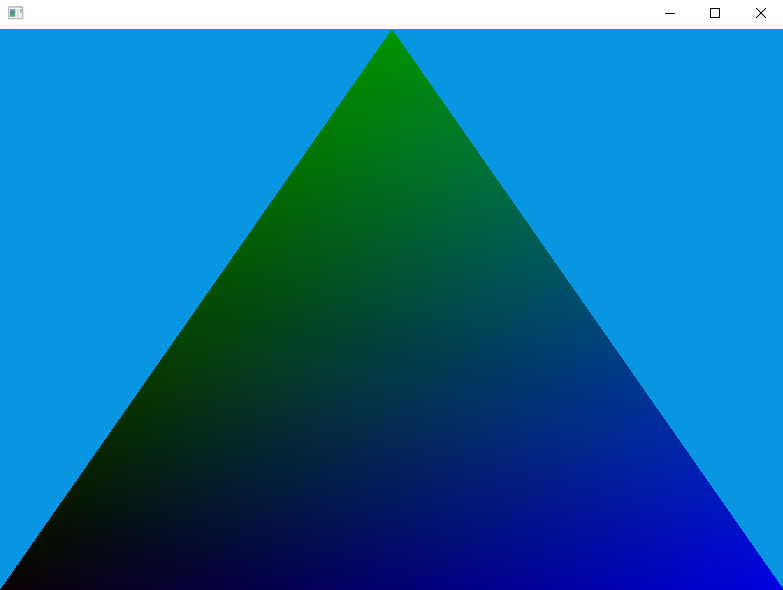

# mtgl

mtgl is a framework for using OpenGL in multithreaded programs. It has support for
creating multiple shared OpenGL contexts as well as synchronizing OpenGL operations
on the same context across different threads.

## Usage

### Functions

Below are a list of significant functions pertaining directly to OpenGL contexts,
see `mtgl/src/mtgl.h` for all functions.

* `glctx *glctx_create(glwin *win, int ver_major, int ver_minor)` - Create an OpenGL
context from a window with the OpenGL version `ver_major.ver_minor`. Can only be done
once per window.
* `glctx *glctx_clone(glctx *ctx)` - Clones an OpenGL context. The new context will
have all its resources shared with a context created from `glctx_create` or `glctx_clone`.
The context must be cloned on the thread on which it was created.
* `void glctx_acquire(glctx *ctx)` - Acquires an OpenGL context so OpenGL calls can be
subsequently made. This allows the same context to be passed around to different threads.
The call will block until another thread calls `glctx_release`. The call is reentrant,
meaning two calls to `glctx_acquire` will not cause deadlock, but the number of calls
to `glctx_acquire` must match the number of calls to `glctx_release`.
* `void glctx_release(glctx *ctx)` - Releases a context acquired from `glctx_acquire` so
another thread can use the context.

Behavior of OpenGL calls outside the bounds of matching `glctx_acquire` and
`glctx_release` calls is undefined.

### Examples

Example main thread usage, using [Glad](https://glad.dav1d.de/) as a loader:
```c
#include <glad/glad.h>
#include "mtgl.h"

int main(int argc, char *argv[])
{
	glwin *win;
	glctx *ctx;
	int width, height;

	mtgl_init(); // initialize mtgl

	win = glwin_create(800, 600); // create 800x600 window
	ctx = glctx_create(win, 3, 3); // create OpenGL 3.3 context

	glctx_acquire(ctx); // acquire the OpenGL context
	gladLoadGLLoader(glctx_get_proc); // load OpenGL functions
	glctx_release(ctx); // release the OpenGL context

	glwin_show_window(win, 1); // show the window

	// loop until the user closes the window
	while (!glwin_should_close(win))
	{
		// get size of window
		glwin_get_size(win, &width, &height);

		glctx_acquire(ctx); // acquire the OpenGL context

		glClearColor(0, 0, 0, 1); // set clear color to black
		glViewport(0, 0, width, height); // set viewport to window size
		glClear(GL_COLOR_BUFFER_BIT); // clear screen

		// do some other drawing...

		glctx_release(ctx); // release the OpenGL context

		glwin_swap_buffers(win); // swap front and back buffers
		glwin_poll_events(win); // poll and handle window events
	}

	glctx_destroy(ctx);
	glwin_destroy(win);

	mtgl_done(); // done with mtgl
	return 0;
}
```

`example/src/main.c` is an example program using the framework. It creates
a window, and immediately launches a worker thread to load OpenGL resources
asynchronously and simulates a long CPU task. This program results in the
render thread running without issue while a triangle's loading time is being
artificially slowed down.

<p align="center">
  
</p>